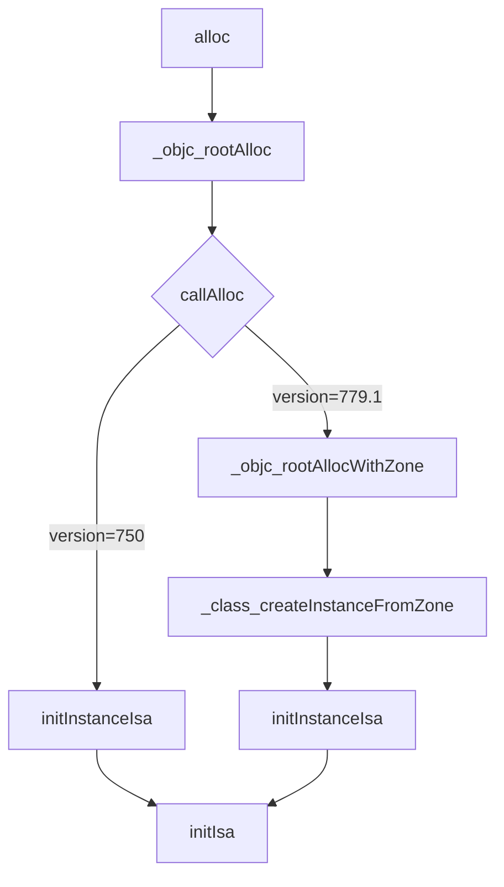

##  objc_debug

编译苹果官方源码objc！探索iOS底层原理 ！objc4-779.1可编译版本，可自由LLDB调试！

[](https://travis-ci.org/LGCooci/objc4_debug)[](https://developer.apple.com/xcode/)[](https://alchemistxxd.visualstudio.com/Apple%20Open%20Source/_git/objc4)  [](https://gitter.im/0xxd0/objc4?utm_source=badge&utm_medium=badge&utm_campaign=pr-badge&utm_content=badge)

> 无需配置工程，直接clone工程，打开编译调试`Apple` 提供的最新源码 `objc4-779.1`，像我们平常开发代码那样直接 LLDB 调试，流程跟踪。


### 探索alloc的过程

首先，之前在`objc4-750`源码下探索了`alloc`的流程，这次探索一下最新源码 `objc4-779.1`，分析2个版本的源码有哪些区别。


#### 探索所在源码 

1. 符号断点设置alloc
2. 代码跟踪 
3. 汇编跟踪 Debug - Debug WorkFlow -  Always Show Disassembly
4. 符号断点识别


#### alloc源码追踪流程




#### 779.1版本注释理解

`callAlloc`

```c++
// Call [cls alloc] or [cls allocWithZone:nil], with appropriate 
// shortcutting optimizations.
static ALWAYS_INLINE id
callAlloc(Class cls, bool checkNil, bool allocWithZone=false)
{
#if __OBJC2__    
  	// slowpath(x)表示x很可能为0，希望编译器进行优化——这里表示cls大概率是有值的，编译器可以不用每次都读取 return nil 指令
    if (slowpath(checkNil && !cls)) return nil;
  
 		// fastpath(x)表示x很可能不为0，希望编译器进行优化；
		if (fastpath(!cls->ISA()->hasCustomAWZ())) {
        return _objc_rootAllocWithZone(cls, nil);
    }
#endif

    // No shortcuts available.
    if (allocWithZone) {
        return ((id(*)(id, SEL, struct _NSZone *))objc_msgSend)(cls, @selector(allocWithZone:), nil);
    }
    return ((id(*)(id, SEL))objc_msgSend)(cls, @selector(alloc));
}

```

`_class_createInstanceFromZone`

```C++
/***********************************************************************
* class_createInstance
* fixme
* Locking: none
*
* Note: this function has been carefully written so that the fastpath
* takes no branch.
**********************************************************************/
static ALWAYS_INLINE id
_class_createInstanceFromZone(Class cls, size_t extraBytes, void *zone,
                              int construct_flags = OBJECT_CONSTRUCT_NONE,
                              bool cxxConstruct = true,
                              size_t *outAllocatedSize = nil)
{
    ASSERT(cls->isRealized());

    // Read class's info bits all at once for performance
  	// hasCxxCtor()是判断当前class或者superclass是否有.cxx_construct 构造方法的实现
    bool hasCxxCtor = cxxConstruct && cls->hasCxxCtor();
  
    // hasCxxDtor()是判断判断当前class或者superclass是否有.cxx_destruct 析构方法的实现
    bool hasCxxDtor = cls->hasCxxDtor();
  
  	// anAllocNonpointer()是具体标记某个类是否支持优化的isa
    bool fast = cls->canAllocNonpointer();
    size_t size;

  	// instanceSize()获取类的大小（传入额外字节的大小）
    size = cls->instanceSize(extraBytes);
    if (outAllocatedSize) *outAllocatedSize = size;

    id obj;
    if (zone) {
      	// 开辟内存
        obj = (id)malloc_zone_calloc((malloc_zone_t *)zone, 1, size);
    } else {
        // 开辟内存
        obj = (id)calloc(1, size);
    }
    if (slowpath(!obj)) {
        if (construct_flags & OBJECT_CONSTRUCT_CALL_BADALLOC) {
            return _objc_callBadAllocHandler(cls);
        }
        return nil;
    }

    if (!zone && fast) {
      // 初始化isa
        obj->initInstanceIsa(cls, hasCxxDtor);
    } else {
        // Use raw pointer isa on the assumption that they might be
        // doing something weird with the zone or RR.
          
      	// 初始化isa
				obj->initIsa(cls);
    }

    if (fastpath(!hasCxxCtor)) {
        return obj;
    }

    construct_flags |= OBJECT_CONSTRUCT_FREE_ONFAILURE;
  	// 便利构造
    return object_cxxConstructFromClass(obj, cls, construct_flags);
}
```

`instanceSize` 

```C++
// 字节对齐
static inline uint32_t word_align(uint32_t x) {
    return (x + WORD_MASK) & ~WORD_MASK;
}

uint32_t unalignedInstanceSize() const {
    ASSERT(isRealized());
    // 获取这个类所有属性内存的大小
    return data()->ro->instanceSize;
}

// 获取类所需要的内存大小
uint32_t alignedInstanceSize() const {
    return word_align(unalignedInstanceSize());
}
// 获取类的大小
size_t instanceSize(size_t extraBytes) const {
  	// 779.1 中新增加的判断
    if (fastpath(cache.hasFastInstanceSize(extraBytes))) {
        return cache.fastInstanceSize(extraBytes);
    }

    size_t size = alignedInstanceSize() + extraBytes;
    // CF requires all objects be at least 16 bytes.
    if (size < 16) size = 16;
    return size;
}
```


#### 字节对齐算法说明

```
已知在64位下，WORD_MASK = 7 (二进制： 0000 0111)

假设 x = 9

x + WORD_MASK = 9 + 7 = 16 (二进制：0001 0000)

~WORD_MASK：取反，即(1111 1000)

x + WORD_MASK和~WORD_MASK做与操作

1111 1000
0001 0000
---------
0001 0000

最后结果： 16。 8字节对齐

```


#### init & new

通过源码可以发现，`init`实际什么也没做，这里采用使用工厂设计模，提供给开发者一个接口。

```objective-c
// Replaced by CF (throws an NSException)
+ (id)init {
    return (id)self;
}

- (id)init {
    return _objc_rootInit(self);
}

id
_objc_rootInit(id obj)
{
    // In practice, it will be hard to rely on this function.
    // Many classes do not properly chain -init calls.
    return obj;
}

```

> 重写子类时
>
> self = [super init]
>
> 这样写的好处是，子类先继承父类的属性，再判断是否为空，为空则直接返回nil

```objc
// 先调用alloc，再init
+ (id)new {
    return [callAlloc(self, false/*checkNil*/) init];
}
```

