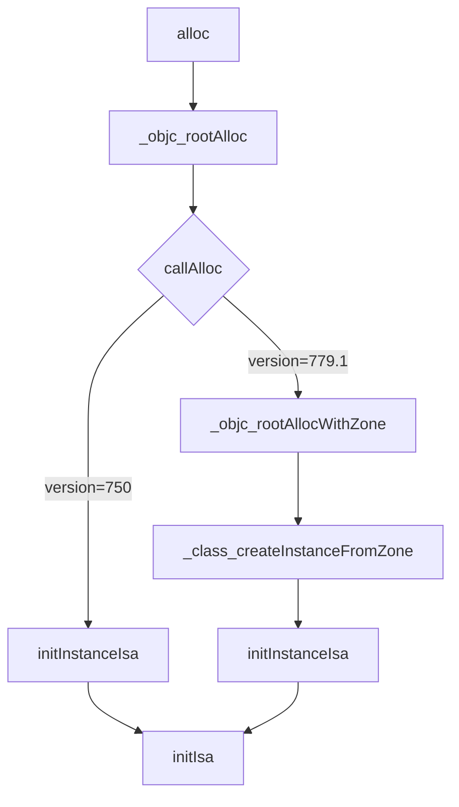

##  objc_debug

编译苹果官方源码objc！探索iOS底层原理 ！objc4-779.1可编译版本，可自由LLDB调试！

  

> 无需配置工程，直接clone工程，打开编译调试`Apple` 提供的最新源码 `objc4-779.1`，像我们平常开发代码那样直接 LLDB 调试，流程跟踪。

### 探索alloc的过程

首先，之前在`objc4-750`源码下探索了`alloc`的流程，这次探索一下最新源码 `objc4-779.1`，分析2个版本的源码有哪些区别。

#### 探索所在源码 

1. 符号断点设置alloc
2. 代码跟踪 
3. 汇编跟踪 Debug - Debug WorkFlow -  Always Show Disassembly
4. 符号断点识别

#### alloc源码流程

